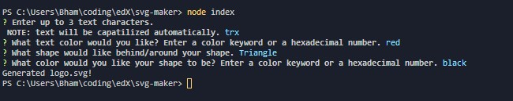

# SVG-maker

## Table of Contents 
* [Description](#Description) 

* [Installation](#Installation) 

* [Usage](#Usage) 

* [License](#License) 

* [Contributing](#Contributing) 

* [Testing](#Testing) 

* [Questions](#Questions) 

* [Examples](#Examples) 

### Description
Node.js command-line application that takes in user input to generate a logo and save it as an SVG file.  
Generated SVG logo is 200(h) x 300(w).

### Installation
`npm install`

### Usage
Through NodeJS, using specifically inquirer.  
See sample video showing application workflow <a href="https://drive.google.com/file/d/16VM3iyqBGFL4B8y_rTFfCZvTNH7dcZ-V/view" target="_blank">here</a>.

### License
Further information regarding this specific license can be found via: https://opensource.org/license/mit/. 

### Contributing
Post <a href="https://github.com/MisterBham/svg-maker/issues" target="_blank">Issues</a> on the repo!

### Testing
Jest test provided to check render method of each shape. 
Perform test via: `npm test`  
See sample test shown <a href="https://drive.google.com/file/d/13MseZBV45AWGObY0cTPuwKKNRvkGRJdY/view" target="_blank">here</a>.

### Questions
Should you have any further questions, please reach the developer at: <a href="mailto:misterbham.dev@gmail.com">misterbham.dev@gmail.com</a>. 

### Examples

